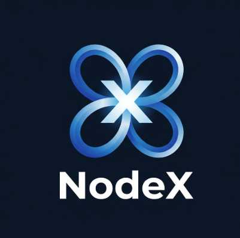
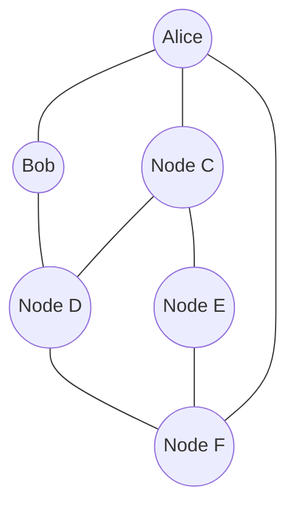

# NodeX — P2P E2EE Messenger on Kademlia DHT

<p align="center">
  
</p>

<p align="center">
  
  
  
  
  
</p>

<p align="center">
  <b>Latest tag: v1.0.0</b>
</p>

<p align="center">
  <b>NodeX</b> is a native Rust desktop messenger with E2EE, direct UDP delivery, and a Kademlia DHT mailbox relay.
</p>

<p align="center">
  
</p>


<p align="center"><i>No central server — every node routes for the network and holds a slice of the DHT.</i></p>

---

## What NodeX does

NodeX is a research-driven MVP for a native peer-to-peer messenger. It runs as a desktop application, creates a
persistent encrypted identity, discovers peers through Kademlia, and sends encrypted messages directly or through
a distributed mailbox when the recipient is offline.

> This repository is still experimental. Local multi-node scenarios are covered by tests, but public-internet
> deployment still needs production bootstrap/relay infrastructure and NAT traversal.

### Highlights

- Native Windows desktop GUI built with Rust and egui.
- 12-word mnemonic account creation and restoration.
- Ed25519 identity signatures and X25519 message encryption.
- Direct UDP `STORE` delivery with `STORE_ACK` confirmation.
- DHT store-and-forward mailbox for offline recipients.
- Automatic local port selection and local bootstrap discovery.
- Contacts, unread indicators, message status ticks, and image attachments.
- Encrypted local messenger database and persistent chat history.

---

## Architecture

```text
┌──────────────────────────────────────────────┐
│                 Desktop GUI (egui)            │
│   identity card · contacts · chat · status    │
└──────────────────────┬────────────────────────┘
                        │
┌──────────────────────▼────────────────────────┐
│                  KadMessenger                  │
│  E2EE identity · presence records · mailbox    │
│  contact DB · local message history            │
└──────────────────────┬────────────────────────┘
                        │
┌──────────────────────▼────────────────────────┐
│                  KademliaNode                  │
│  k-bucket routing table · iterative lookup     │
│  UDP transport (Tokio) · RPC retry/timeout     │
└──────────────────────┬────────────────────────┘
                        │
┌──────────────────────▼────────────────────────┐
│                     C core (FFI)               │
│   message serialization · node ID hashing      │
└─────────────────────────────────────────────────┘
```

Two identities are deliberately separate:

| Layer | Purpose | Lifetime |
|---|---|---|
| **Transport Node ID** | Position in the Kademlia routing table (XOR distance) | Can rotate per session/device |
| **User E2EE Identity** | Cryptographic identity for encrypted messaging | Persistent across sessions |

---

## Implemented

**Network layer**
- XOR-metric routing table with k-buckets
- Iterative `FIND_NODE` / `FIND_VALUE` lookup
- UDP transport on Tokio, with RPC timeout and retry
- Key/value storage with TTL, replicated across nodes
- Automatic port fallback when the preferred port is busy
- Bootstrap, peer tracking, reconnect, and health modules

**Messenger layer**
- Presence records published to the DHT for peer discovery
- Mailbox-style relay for offline recipients
- E2EE envelope creation and decryption
- Persistent local contact and message database
- Mnemonic identity restore
- Delivery and read-status building blocks
- Contact trust, profile, attachment, and blocklist modules

**Core (C)**
- Manual binary serialization for wire messages
- Node ID hashing, isolated behind a small FFI boundary

---

## Verification status

- [x] Single node starts, generates transport + identity IDs, binds UDP, publishes presence
- [x] GUI renders identity, contacts panel, chat panel
- [x] Two-node bootstrap and automatic local port fallback
- [x] Direct UDP `STORE` with `STORE_ACK`
- [x] DHT mailbox store-and-forward tests
- [x] Mnemonic, identity, trust, attachment, and receipt tests
- [x] Workspace test suite: 44 discovered tests pass locally
- [ ] Public-internet delivery across NAT without an external relay
- [ ] Production bootstrap nodes and signed release distribution

The unchecked items are deployment work, not a claim that the local network prototype is production-ready.

---

## Quick start

### Download the Windows release

The current release tag is [v1.0.0](https://github.com/NetGadz/NodeX/tree/v1.0.0).
The Windows package contains the optimized `nodex.exe`, logo, default configuration, and a copy of this README.

For source builds, use the commands below.

```bash
cargo test --workspace
cargo run -p nodex-gui
```

Run `cargo run -p nodex-gui` in a second terminal to start another local instance.
The application selects the next available local UDP port and attempts local bootstrap discovery automatically.
No `--port` or `--bootstrap` arguments are required for the local demo.

For a clean Windows build:

```powershell
.\scripts\build-release.ps1
```

The packaged artifacts are written to `dist/` by the release script.

To build the complete Windows ZIP package:

```powershell
.\scripts\package-windows.ps1 -Version "1.0.0"
```

The local output is:

```text
dist/NodeX-v1.0.0-windows-x64.zip
```

The release tag is published in GitHub. The generated ZIP is kept out of source control; it can be attached to a
GitHub Release as a binary asset. Local user databases are never part of the release.

Each node logs both identifiers on startup:
```text
[IDENTITY] User Messenger E2EE ID:     87bdd166404d7617486a8f67eea39ae8814c90eb
[IDENTITY] Kademlia Transport Node ID: ef9188c14d1e4747912b9f6c08da3ccf31fb07cf
```

---

## Demo flow

```text
Alice (:8000)  --publish presence-->  DHT
Bob   (:8001)  --bootstrap join--->   Alice
Bob   --FIND_VALUE mailbox_Alice-->   DHT  --> message delivered
```

<p align="center">
  
</p>

1. Open the app and create or restore a 12-word identity.
2. Start a second instance; it selects a free port automatically.
3. Add a contact by the 40-character User ID.
4. Send text or an image directly, with DHT mailbox fallback when the peer is offline.

---

## Project structure

```text
.
├── Cargo.toml
├── core-ffi/                  # C wire, hashing, and mnemonic boundary
├── nodex-kademlia/            # Routing, RPC, DHT storage, bootstrap, peers
├── nodex-messenger/           # Identity, E2EE, contacts, mailbox, receipts
├── nodex-gui/                 # Native egui desktop application and logo
├── nodex-cli/                 # Diagnostics and interactive CLI
├── config/                    # Development and bootstrap configuration
├── docs/                      # Architecture, security, protocol, release docs
├── deploy/                    # Windows, Linux, and macOS packaging layouts
├── data/                      # Development-only data placeholder
├── dist/                      # Local release output, ignored from source control
└── scripts/                   # Demo, testing, cleanup, and release scripts
```

---

## Roadmap

- [x] Confirm local end-to-end delivery across multiple nodes
- [x] Add bounded image attachment delivery
- [ ] Add production bootstrap and relay nodes
- [ ] NAT traversal for nodes outside a local network
- [ ] Complete signed delivery/read receipt protocol
- [ ] Identity verification with out-of-band trust
- [x] Windows release build and `v1.0.0` tag
- [ ] Windows installer asset and signed release artifacts
- [ ] Broader tests for node churn and partial failures

---

## Contributing

Issues, protocol critique, and PRs are welcome — see [CONTRIBUTING.md](CONTRIBUTING.md).

## License

MIT