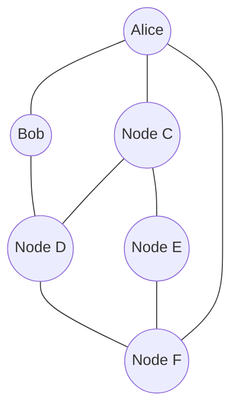

# NodeX — P2P Messenger on Kademlia DHT

<p align="center">
  
  
  
  
  
</p>

<p align="center">
  <b>NodeX</b> is a decentralized messenger prototype built on a from-scratch Kademlia DHT implementation —
  no central server, no relay infrastructure, just nodes finding each other by XOR distance.
</p>


<p align="center"><i>No central server — every node routes for the network and holds a slice of the DHT.</i></p>

---

## What this is (and isn't)

NodeX is a **research / learning project**, not a production messenger. The goal is to build and understand
a real peer-to-peer stack end to end: routing, peer discovery, distributed storage, and encrypted delivery —
without leaning on libp2p or an existing DHT crate.

> **Status: pre-alpha.** Core networking and messenger logic exist and compile; multi-node message delivery
> across a live network is the current validation milestone (see [Verified so far](#verified-so-far)).

---

## Architecture

```text
┌──────────────────────────────────────────────┐
│                 Desktop GUI (egui)            │
│   identity card · contacts · chat · status    │
└──────────────────────┬────────────────────────┘
                        │
┌──────────────────────▼────────────────────────┐
│                  KadMessenger                  │
│  E2EE identity · presence records · mailbox    │
│  contact DB · local message history            │
└──────────────────────┬────────────────────────┘
                        │
┌──────────────────────▼────────────────────────┐
│                  KademliaNode                  │
│  k-bucket routing table · iterative lookup     │
│  UDP transport (Tokio) · RPC retry/timeout     │
└──────────────────────┬────────────────────────┘
                        │
┌──────────────────────▼────────────────────────┐
│                     C core (FFI)               │
│   message serialization · node ID hashing      │
└─────────────────────────────────────────────────┘
```

Two identities are deliberately separate:

| Layer | Purpose | Lifetime |
|---|---|---|
| **Transport Node ID** | Position in the Kademlia routing table (XOR distance) | Can rotate per session/device |
| **User E2EE Identity** | Cryptographic identity for encrypted messaging | Persistent across sessions |

---

## Implemented

**Network layer**
- XOR-metric routing table with k-buckets
- Iterative `FIND_NODE` / `FIND_VALUE` lookup
- UDP transport on Tokio, with RPC timeout and retry
- Key/value storage with TTL, replicated across nodes

**Messenger layer**
- Presence records published to the DHT for peer discovery
- Mailbox-style relay for offline recipients
- E2EE envelope creation and decryption
- Persistent local contact and message database

**Core (C)**
- Manual binary serialization for wire messages
- Node ID hashing, isolated behind a small FFI boundary

---

## Verified so far

- [x] Single node starts, generates transport + identity IDs, binds UDP, publishes presence
- [x] GUI renders identity, contacts panel, chat panel
- [ ] **Two-node bootstrap**: routing table fills via `FIND_NODE` against a bootstrap peer
- [ ] **Cross-node delivery**: message sent from node A is retrieved by node B via DHT mailbox
- [ ] Behavior under partial node failure (replica survives when some holders go offline)

The unchecked items are the actual point of the project and the current focus — everything above them
is infrastructure in service of getting there.

---

## Quick start

```bash
cargo build
```

**Node 1 (bootstrap node):**
```bash
cargo run -- --name "Alice" --port 8000
```

**Node 2 (joins via Alice):**
```bash
cargo run -- --name "Bob" --port 8001 --bootstrap 127.0.0.1:8000
```

Each node logs both identifiers on startup:
```text
[IDENTITY] User Messenger E2EE ID:     87bdd166404d7617486a8f67eea39ae8814c90eb
[IDENTITY] Kademlia Transport Node ID: ef9188c14d1e4747912b9f6c08da3ccf31fb07cf
```

---

## Demo

```text
Alice (:8000)  --publish presence-->  DHT
Bob   (:8001)  --bootstrap join--->   Alice
Bob   --FIND_VALUE mailbox_Alice-->   DHT  --> message delivered
```
<!-- Замени на docs/demo.gif с записью реального запуска, когда закоммитишь в репозиторий -->

---

## Project structure

```text
.
├── Cargo.toml
├── build.rs
├── Dockerfile / docker-compose.yml
├── core/                      # C — hashing, wire serialization
│   ├── hash.c / hash.h
│   ├── messenger_core.c / .h
│   └── serialize.c / .h
├── src/
│   ├── node.rs                # NodeId, XOR distance, k-buckets, routing table
│   ├── rpc.rs                 # RPC message types
│   ├── lookup.rs              # Iterative FIND_NODE / FIND_VALUE
│   ├── storage.rs             # DHT key/value store, TTL, replication
│   ├── messenger.rs           # Presence, mailbox, contact flow
│   ├── crypto.rs              # E2EE envelope handling
│   ├── db.rs                  # Local persistence
│   ├── gui.rs                 # egui desktop client
│   ├── config.rs / metrics.rs / state.rs
│   └── main.rs
├── tests/
│   ├── integration_test.rs
│   └── messenger_test.rs
└── scripts/demo.sh / demo.ps1
```

---

## Roadmap

- [ ] Confirm end-to-end delivery across a live multi-node network
- [ ] Reduce mailbox polling to event-driven / backoff instead of tight-loop retry
- [ ] NAT traversal for nodes outside a local network
- [ ] Identity verification (key fingerprints, out-of-band trust)
- [ ] Broader test coverage for node churn and partial failures
- [ ] Clean up FFI boundary and public API surface

---

## Contributing

Issues, protocol critique, and PRs are welcome — see [CONTRIBUTING.md](CONTRIBUTING.md).

## License

MIT