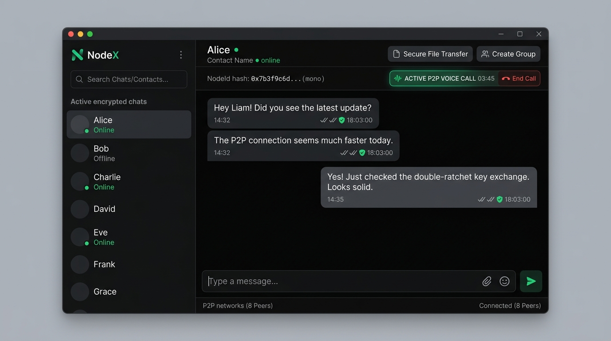
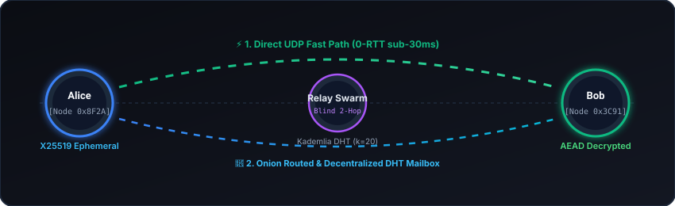
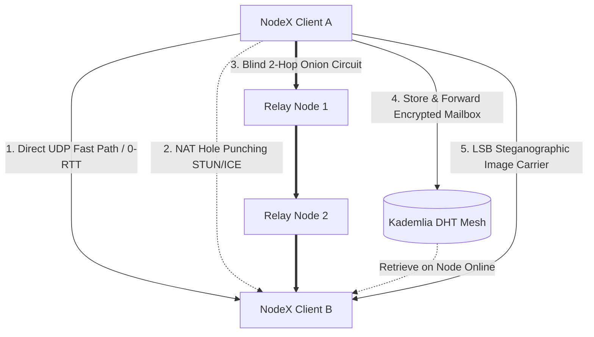
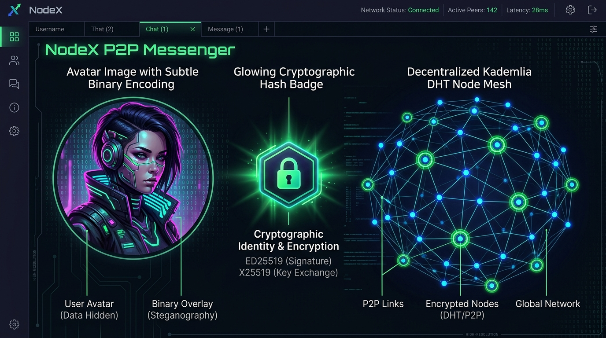

<div align="center">

# ⚡ NodeX

### Next-Generation Sovereign P2P Communications Engine
**Zero Central Servers • End-to-End Cryptographic Sovereignty • Decentralized Kademlia Mesh • Stego-Carriers**

[](https://github.com/NetGadz/NodeX/releases)
[](https://github.com/NetGadz/NodeX/actions)
[](LICENSE)
[](https://www.rust-lang.org/)
[](https://github.com/NetGadz/NodeX/releases)

<br/>

<p align="center">
  
</p>

<br/>

[🚀 **GitHub Releases & Downloads**](https://github.com/NetGadz/NodeX/releases) • [📥 **Download NodeX.exe**](https://github.com/NetGadz/NodeX/releases/tag/v1.0.0) • [📦 **Download ZIP Archive**](https://github.com/NetGadz/NodeX/releases/tag/v1.0.0) • [🛡️ **Security Model**](#-cryptographic--security-architecture)

</div>

---

## 📌 Overview

**NodeX** is a sovereign, serverless, peer-to-peer (P2P) desktop communication platform written from the ground up in modern **Rust**. 

Unlike conventional "secure" messengers that rely on centralized routing servers, phone number registrations, or proprietary cloud infrastructure, NodeX creates an autonomous distributed overlay network. Every client is an independent cryptographic node that participates directly in routing, distributed storage, and zero-knowledge message relaying.

---

## 🚀 Downloads (Windows x64)

| Asset | Description | Direct Link |
| :--- | :--- | :--- |
| 🚀 **NodeX.exe** | Standalone production executable (Portable) | [**Download via Release v1.0.0**](https://github.com/NetGadz/NodeX/releases/tag/v1.0.0) |
| 📦 **NodeX-windows-x64.zip** | Full archive (Binary + Docs + License) | [**Download ZIP Package**](https://github.com/NetGadz/NodeX/releases/tag/v1.0.0) |
| 🌐 **All Releases & Notes** | View changelog, checksums and previous builds | [**GitHub Releases Hub**](https://github.com/NetGadz/NodeX/releases) |

---

## ⚡ Real-Time P2P Mesh & 5-Tier Delivery Cascade

<p align="center">
  
</p>



### 1. 🛡️ Cryptographic Zero-Trust Core
- **Asymmetric Identity**: Native **Ed25519** signing keys and **X25519** key-agreement identities.
- **Double Ratchet Engine**: Forward Secrecy (PFS) and Break-in Recovery for every session using **HKDF-SHA256** and **ChaCha20-Poly1305** AEAD.
- **Zero-Knowledge Addressing**: User identities are 256-bit cryptographic public hashes (`NodeId`). No phone numbers, emails, or KYC required.

### 2. ⚡ 5-Tier Resilient Delivery Cascade
1. **Direct Fast-Path UDP (0-RTT)**: Low-latency direct socket transport for active peers.
2. **Autonomous NAT Traversal (ICE/STUN)**: Hole-punching mechanism resolving Symmetric and Cone NATs across diverse WAN topologies.
3. **Blind 2-Hop Onion Routing**: Multi-layered payload encapsulation across random intermediary nodes, hiding IP origins from recipients and ISPs.
4. **Decentralized DHT Mailbox (Store-and-Forward)**: When a recipient is offline, encrypted blobs are sharded and deposited into Kademlia DHT neighborhood storage with time-to-live (TTL) expiration.
5. **Steganographic Crypto-Carriers**: Out-of-band identity and credential transmission through covert LSB embedding inside standard images.

---

## 🖼️ Steganographic Crypto-Avatars & DHT Swarm

<p align="center">
  
</p>

- **Deep LSB Encoding**: Embeds complete cryptographic contact descriptors (public keys, DHT rendezvous tokens, endpoints) invisibly inside 24-bit PNG/JPEG pixel matrices.
- **Air-Gapped Contact Onboarding**: Share your contact avatar across regular public image hosting platforms or social channels without triggering DPI surveillance or metadata scrapers.

---

## 🎙️ Real-Time P2P Voice & Media Subsystem
- **Direct Low-Latency Voice Calling**: Low-overhead UDP fast-path with sub-50ms latency.
- **Encrypted Media Buffering**: Dedicated ring-buffer audio pipeline powered by `cpal` and `rodio` with non-blocking audio capture and playback.
- **Dynamic Connection Recovery**: Seamless fallback if UDP ports or network interfaces switch mid-call.

---

## 🏗️ Monorepo Architecture

The workspace is organized into clean, modular Rust crates:

```
NodeX/
├── nodex-gui/          # Native GPU-accelerated desktop interface (eframe/egui)
├── nodex-messenger/    # Double Ratchet, E2EE Session Engine, Audio Pipeline, Stego
├── nodex-kademlia/     # Distributed Hash Table, Routing Table (k-buckets), RPC
├── nodex-cli/          # Headless daemon, management CLI and automation harness
├── core-ffi/           # C-compatible FFI bindings for mobile/cross-platform embedding
├── assets/             # Vector diagrams, banners, and media showcases
├── .github/workflows/  # Automated CI/CD release build pipeline
├── LICENSE             # GNU General Public License v3.0
└── Cargo.toml          # Workspace root manifest
```

---

## 🛠️ Building From Source

### Prerequisites
- **Rust Toolchain**: `1.75.0` or later ([rustup.rs](https://rustup.rs/))
- **Build Tools**: CMake, MSVC (Windows) or `build-essential` / `libasound2-dev` (Linux)

### Build Steps

1. **Clone the repository:**
   ```bash
   git clone https://github.com/NetGadz/NodeX.git
   cd NodeX
   ```

2. **Compile the Desktop Application in Release Mode:**
   ```bash
   cargo build --release -p nodex-gui
   ```

3. **Run NodeX:**
   ```bash
   # Windows
   .\target\release\nodex-gui.exe

   # Linux / macOS
   ./target/release/nodex-gui
   ```

4. **Run Headless CLI Node:**
   ```bash
   cargo run --release -p nodex-cli -- --help
   ```

---

## 🔐 Cryptographic & Security Specification

| Layer | Primitive / Algorithm | Specification & Purpose |
| :--- | :--- | :--- |
| **Node Identity** | `Ed25519` (RFC 8032) | Digital signatures, authentication & Node ID hashing |
| **Key Agreement** | `X25519` (RFC 7748) | Diffie-Hellman ephemeral key exchanges |
| **Symmetric Cipher** | `ChaCha20-Poly1305` | Authenticated Encryption with Associated Data (AEAD) |
| **Key Derivation** | `HKDF-SHA256` & `Argon2id` | KDF for double ratchet states and local vault master keys |
| **Routing Protocol**| `Kademlia DHT` ($k=20, \alpha=3$) | $\mathcal{O}(\log N)$ distributed peer and message discovery |
| **Steganography** | Custom 2-bit LSB Carrier | Encrypted payload embedding with CRC32 integrity validation |

---

## 🤝 Contributing

Contributions from the security, cryptography, and decentralized networking communities are welcomed.

1. **Fork** the repository.
2. Create your feature branch (`git checkout -b feature/quantum-hardening`).
3. Ensure the workspace compiles cleanly (`cargo check --workspace`).
4. Commit your changes (`git commit -m 'feat: implement hybrid post-quantum ratchet'`).
5. Push to the branch (`git push origin feature/quantum-hardening`).
6. Open a **Pull Request**.

---

## 📄 License

This project is licensed under the **GNU General Public License v3.0 (GPL-3.0)**.  
See the [LICENSE](LICENSE) file for full license text and permissions.

---

<div align="center">
  <sub>Built with ❤️ and Rust for privacy, human sovereignty, and true decentralization.</sub>
  <br/>
  <sub>© 2026 NodeX Project Contributors</sub>
</div>
