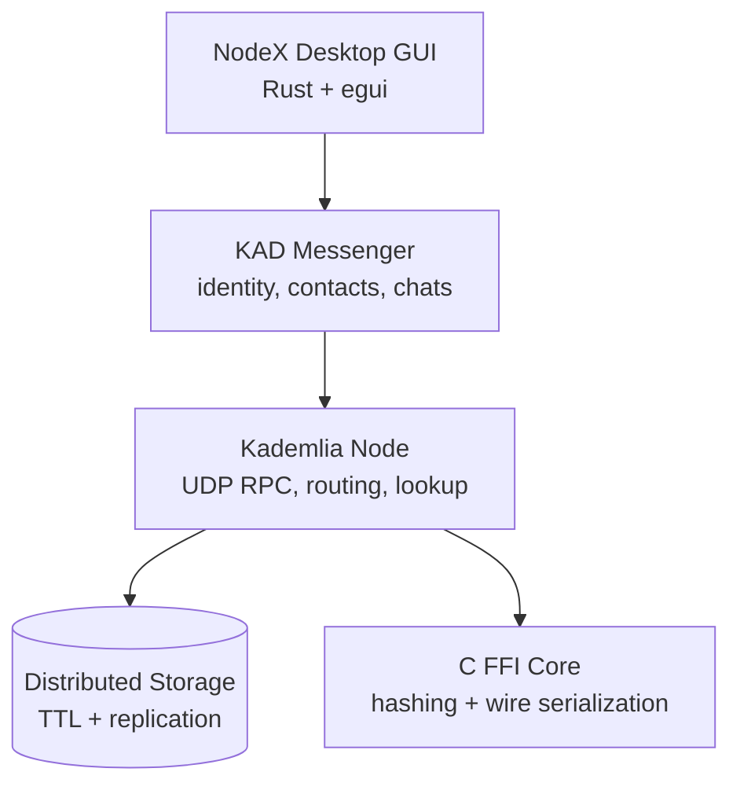
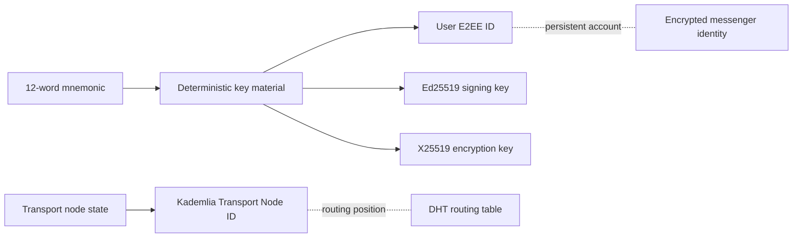
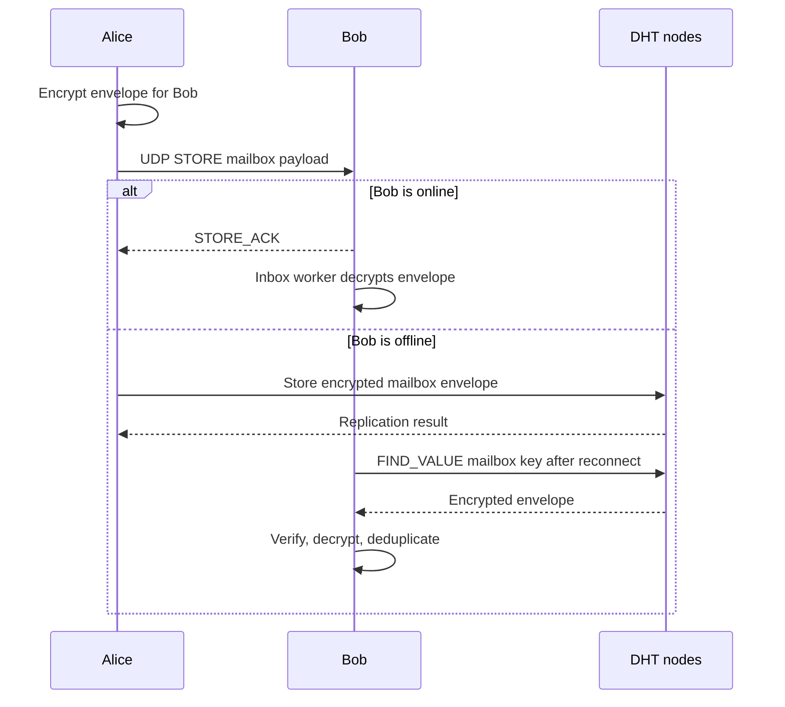
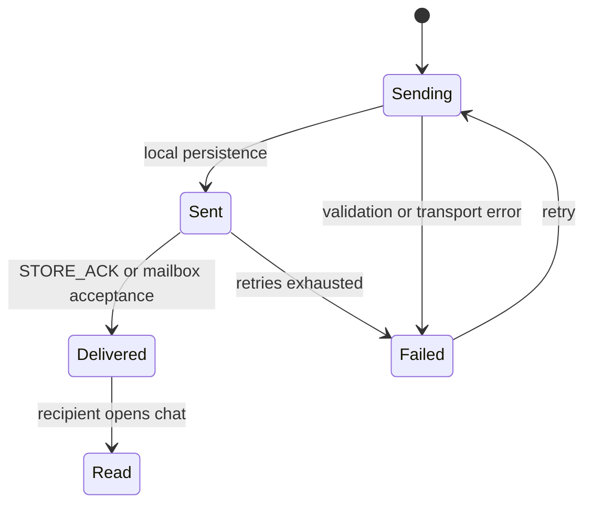
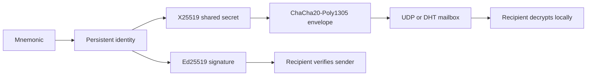

# NodeX

<p align="center">
  
</p>

<p align="center">
  <strong>Native P2P E2EE Messenger</strong><br />
  Direct UDP delivery, Kademlia DHT discovery, and encrypted offline mailbox relay.
</p>

<p align="center">
  <a href="https://github.com/NetGadz/NodeX/tree/v1.0.0"></a>
  
  
  
  
  
</p>

<p align="center">
  
</p>

> NodeX is an experimental MVP. Local multi-node delivery is tested; public-internet deployment still needs production bootstrap nodes, NAT traversal, and relay infrastructure.

## Product Snapshot

NodeX is a native Rust desktop messenger designed around a distributed network instead of a central message server.
Each running instance owns a transport node, participates in Kademlia routing, and keeps its user identity separate
from its network identity.

### What works today

- Windows desktop GUI built with Rust and egui.
- Account creation and restoration with a 12-word mnemonic flow.
- Persistent user identity with Ed25519 signing and X25519 encryption keys.
- Direct UDP `STORE` delivery with `STORE_ACK` confirmation.
- DHT store-and-forward mailbox for offline recipients.
- Automatic local UDP port fallback when the preferred port is busy.
- Local bootstrap discovery across ports `8000..8010`.
- Contact search by 40-character User ID.
- Encrypted local messenger database and chat history.
- Text and bounded image attachments.
- Contact profiles, unread indicators, status ticks, and diagnostics modules.

<p align="center">
  
</p>

## Architecture



### Identity separation



| Identity | Used for | Persistence |
| --- | --- | --- |
| User E2EE identity | Signatures, encryption, contacts, account recovery | Persistent |
| Transport node identity | Kademlia XOR distance and routing | Persistent state, can be rotated |

## Message Delivery



### Message lifecycle



The current transport uses a shared DHT mailbox key and envelope deduplication. A future protocol revision will use
per-message mailbox keys and signed delivery/read receipts as first-class wire events.

## Security Model



- Message contents are encrypted before transport.
- DHT storage holds encrypted envelopes, not plaintext chat text.
- Presence cards carry public keys and signatures.
- User IDs and transport IDs are different values.
- The local database is stored in an encrypted format in the current MVP.

Before public production use, the project still needs OS-backed key storage, a reviewed standard mnemonic derivation,
key-change warnings, replay protection, and a complete signed receipt protocol. Do not treat the current build as a
security-audited messenger.

## Download

The current source tag is [v1.0.0](https://github.com/NetGadz/NodeX/tree/v1.0.0).

The Windows package is generated locally as:

```text
dist/NodeX-v1.0.0-windows-x64.zip
```

It contains:

```text
nodex.exe
logo.png
config.json
README.txt
```

Generated binaries and local user databases are intentionally not committed to the repository. Attach the ZIP to a
GitHub Release when distributing the executable to end users.

## Quick Start: Windows Development

Requirements:

- Windows 10 or newer.
- Rust toolchain with Cargo.
- A C compiler supported by the Rust toolchain.

Run tests:

```powershell
cargo test --workspace
```

Start the GUI:

```powershell
cargo run -p nodex-gui
```

Start a second local node by running the same command in another terminal. The second instance automatically tries
the next available UDP port and searches local bootstrap ports. No `--port` or `--bootstrap` argument is required for
the local demo.

Build optimized binaries:

```powershell
.\scripts\build-release.ps1
```

Build the Windows ZIP package:

```powershell
.\scripts\package-windows.ps1 -Version "1.0.0"
```

The output is written to `dist/`.

## First-Run Flow

1. Open NodeX.
2. Create an account and save the 12-word recovery phrase, or restore an existing account.
3. Choose a display name and optional bio.
4. Copy the User ID from the profile panel.
5. Add the second user by User ID.
6. Open the contact and send a text or a small image.
7. Start the recipient later to exercise mailbox store-and-forward.

Never share a recovery phrase. Anyone with the phrase can recreate the account identity.

## Repository Layout

```text
.
|- Cargo.toml
|- core-ffi/                  C hashing, mnemonic, and wire boundary
|- nodex-kademlia/            routing, RPC, DHT storage, bootstrap, peers
|- nodex-messenger/           identity, E2EE, contacts, mailbox, receipts
|- nodex-gui/                 native desktop client and logo asset
|- nodex-cli/                 diagnostics and interactive CLI
|- config/                    development and bootstrap configuration
|- docs/                      architecture, protocol, security, release docs
|- deploy/                    Windows, Linux, and macOS packaging layouts
|- data/                      development-only placeholder
`- scripts/                   build, demo, test, and cleanup scripts
```

### Important modules

| Package | Key modules |
| --- | --- |
| `core-ffi` | `mnemonic.c`, `serialize.c`, `hash.c` |
| `nodex-kademlia` | `node.rs`, `rpc.rs`, `lookup.rs`, `storage.rs`, `bootstrap.rs`, `peer_manager.rs` |
| `nodex-messenger` | `crypto.rs`, `identity.rs`, `messenger.rs`, `mailbox.rs`, `presence.rs`, `receipts.rs` |
| `nodex-gui` | `main.rs`, `gui.rs`, `assets/logo.png` |

## Tests and Verification

The workspace currently contains local unit and integration coverage for:

- C FFI mnemonic roundtrip.
- Node IDs, XOR distance, and k-buckets.
- Port fallback and bootstrap.
- DHT storage, TTL, replication, and node failure.
- E2EE encryption and tamper detection.
- Identity restore and contact verification.
- Mailbox delivery and deduplication.
- Attachments, receipts, replay checks, and reconnect modules.

Run the complete suite:

```powershell
cargo test --workspace
```

The locally verified workspace baseline is 44 discovered tests passing. Always rerun the suite after changing the
wire format, identity derivation, mailbox behavior, or GUI message model.

## Production Gaps

NodeX is not yet a public-internet production messenger. The remaining deployment work includes:

- Public bootstrap nodes with health monitoring.
- NAT traversal or relay support for users behind routers.
- IPv4/IPv6 and network-change recovery.
- A complete per-message queue with signed delivery/read receipts.
- OS-backed local secret storage and security review.
- Signed installers and release assets.
- External-network end-to-end tests.

## Documentation

- [Architecture](docs/architecture.md)
- [Protocol](docs/protocol.md)
- [Networking](docs/networking.md)
- [Security](docs/security.md)
- [Threat model](docs/threat-model.md)
- [Account recovery](docs/account-recovery.md)
- [Message lifecycle](docs/message-lifecycle.md)
- [Bootstrap nodes](docs/bootstrap-nodes.md)
- [Release guide](docs/release.md)
- [Testing guide](docs/testing.md)
- [Troubleshooting](docs/troubleshooting.md)
- [Production MVP specification](docs/production-mvp-tz.txt)

## Roadmap

- [x] Local multi-node bootstrap and automatic port fallback.
- [x] Direct UDP store with acknowledgement.
- [x] DHT mailbox store-and-forward path.
- [x] Mnemonic identity and encrypted local database format.
- [x] Windows release build and `v1.0.0` tag.
- [ ] Public bootstrap and relay infrastructure.
- [ ] NAT traversal across different home networks.
- [ ] Complete signed delivery/read receipt protocol.
- [ ] Security audit and OS-backed secret storage.
- [ ] Signed installer and automatic update channel.

## Contributing

Issues, protocol critiques, tests, and pull requests are welcome. Read [CONTRIBUTING.md](CONTRIBUTING.md) before
opening a change.

## License

MIT. See [LICENSE](LICENSE).
