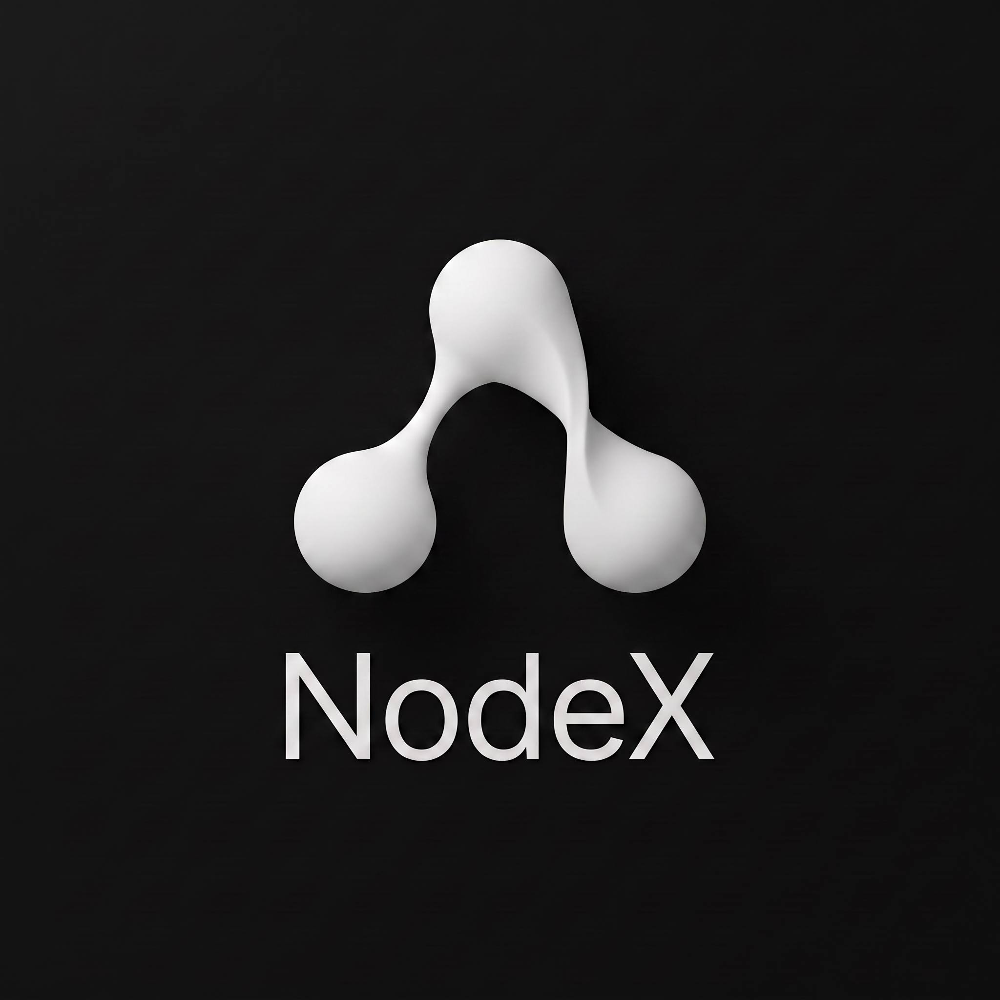
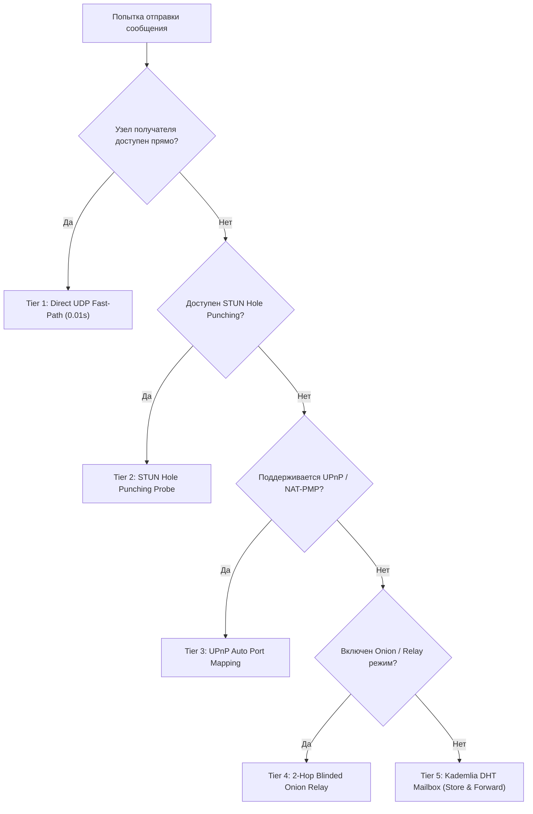

<div align="center">

  

  # ⚡ NodeX P2P Messenger

  **Pure Rust Native Decentralized & End-to-End Encrypted Communication Protocol**

  <p align="center">
    <a href="https://github.com/rust-lang/rust"></a>
    <a href="https://github.com/emilk/egui"></a>
    <a href="https://en.wikipedia.org/wiki/Kademlia"></a>
    <a href="https://github.com/RustCrypto"></a>
    <a href="LICENSE"></a>
  </p>

  <p align="center">
    <b>Zero Central Servers</b> • <b>Zero Metadata</b> • <b>STUN Hole Punching</b> • <b>2-Hop Blind Onion Routing</b> • <b>LSB Steganography</b>
  </p>

  <p align="center">
    <a href="#-english-overview">English</a> •
    <a href="#-описание-проекта">Русский</a> •
    <a href="#-сравнение-с-аналогами">Сравнение</a> •
    <a href="#-архитектура-системы">Архитектура</a> •
    <a href="#-криптография-и-модель-угроз">Безопасность</a> •
    <a href="#-быстрый-старт">Быстрый старт</a>
  </p>

</div>

---

## 📸 Интерфейс и Демонстрация (Previews)

| 💬 Чат и Голосовые Waveform | 🖼 Стеганография (Stego-Carriers) |
| :---: | :---: |
|  |  |
| *Компактные бабблы сообщений, нативный замер аудио-волны и аудиозвонки* | *Кодирование крипто-паспорта ноды в младшие биты пикселей PNG/JPG* |

---

## 🇷🇺 Описание проекта

**NodeX** — это автономный децентрализованный мессенджер нового поколения, написанный на **чистом Rust** без использования Electron или внешних серверов базы данных.

Приложение спроектировано по принципу **Zero-Trust & Zero-Metadata**:
- **0 телефонных номеров, 0 Email, 0 учетных записей.**
- **Никаких центральных серверов логов или хранилищ.**
- Все коммуникации (текстовые сообщения, файлы, голосовые заметки и прямые P2P-аудиовызовы) передаются напрямую по протоколу UDP с шифрованием **E2EE (ChaCha20-Poly1305 + X25519)**.

---

## 📊 Сравнение с аналогами

| Критерий | ⚡ **NodeX** | ✈️ Telegram | 🔒 Signal | 🌀 Session | ☣️ Tox |
| :--- | :---: | :---: | :---: | :---: | :---: |
| **Центральные серверы** | ❌ **0 серверов** | ⚠️ Да | ⚠️ Да | ❌ P2P Service Nodes | ❌ 0 серверов |
| **Регистрация по номеру** | ❌ **Не требуется** | ⚠️ Обязательно | ⚠️ Обязательно | ❌ Не требуется | ❌ Не требуется |
| **Защита метаданных (IP)** | ✅ **2-Hop Onion** | ❌ Сервер видит все IP | ❌ Сервер видит все IP | ✅ Onion Routing | ⚠️ Только с Tor |
| **Стеганография (LSB)** | ✅ **Встроена** | ❌ Нет | ❌ Нет | ❌ Нет | ❌ Нет |
| **Потребление RAM** | ⚡ **~25-40 МБ** | 🐢 ~300-800 МБ | 🐢 ~400-900 МБ | 🐢 ~350-700 МБ | ⚡ ~30-60 МБ |
| **Язык разработки / Движок** | 🦀 **Pure Rust + egui** | C++ / Qt | C++ / Electron | JS / Electron | C / C++ |

---

## 🌟 Ключевые технологические фичи

### 🛡️ 1. Децентрализованная идентичность (BIP-39 & Ed25519)
Идентификатор пользователя генерируется детерминированно из 12/24 слов мнемонической фразы BIP-39. Отсутствует единая база пользователей — подделка профиля криптографически невозможна благодаря цифровой подписи Ed25519.

### 🧅 2. Слепая 2-Hop Onion маршрутизация ([onion.rs](file:///c:/Users/gadz7/Downloads/NodeX-main/nodex-kademlia/src/onion.rs))
Для защиты IP-адреса трафик послойно зашифровывается и передается через два случайных промежуточных узла-ретраслятора в DHT-сети:
```text
[Отправитель (Вы)] ──(Слой 1+2)──> [Relay Node 1] ──(Слой 2)──> [Relay Node 2] ──(Открыто)──> [Получатель]
                                (Видит ваш IP,             (Видит IP Relay 1,
                                но НЕ видит текст          но НЕ видит ваш IP)
                                 и получателя)
```

### 🖼️ 3. Стеганографические крипто-аватарки (Stego-Carriers)
Встраивание криптографического паспорта узла (`Node ID` + `X25519 PubKey` + `STUN Endpoints`) непосредственно в наименее значимые биты (LSB) пикселей любого изображения. Достаточно отправить обычную картинку в соцсети — NodeX при загрузке автоматически извлечет из нее инвайт и создаст туннель.

### 🎙️ 4. P2P Аудиозвонки & Голосовые Waveform
Прямая зашифрованная передача легковесного аудиопотока по UDP с низкой задержкой. Для голосовых сообщений генерируется вектор огибающей амплитуды для нативного отображения осциллограммы.

---

## 🏗 Архитектура системы

```text
┌─────────────────────────────────────────────────────────────────────────┐
│                    NodeX Desktop GUI (egui / eframe)                    │
│   Cyberpunk & OLED Themes • Movable Modals • Waveforms • Stego Studio   │
└────────────────────────────────────┬────────────────────────────────────┘
                                     │ UI Events / Commands (tokio mpsc)
┌────────────────────────────────────▼────────────────────────────────────┐
│                          nodex-messenger Layer                          │
│   User Identity (Ed25519 / X25519) • BIP-39 Mnemonic Seed Derivation    │
│   Stego-Carrier LSB Engine • Local Encrypted ChaCha20-Poly1305 DB       │
│   5-Tier Delivery Cascade • Audio Call Engine • Contact Trust Registry  │
└────────────────────────────────────┬────────────────────────────────────┘
                                     │ UDP Wire Packets / Kademlia RPC
┌────────────────────────────────────▼────────────────────────────────────┐
│                          nodex-kademlia Layer                           │
│   Kademlia DHT Routing • RFC 5389 STUN Traversal • UPnP IGD & NAT-PMP   │
│   UDP Hole Punching Probes • Blind 2-Hop Onion Router • UDP Chunking    │
│   Decentralized Store-and-Forward DHT Mailbox • LAN UDP Broadcast       │
└─────────────────────────────────────────────────────────────────────────┘
```

---

## ⚡ 5-Уровневый каскад доставки (Delivery Cascade)



---

## 🔒 Криптография и модель угроз

| Компонент | Алгоритм / Спецификация | Назначение |
| :--- | :--- | :--- |
| **Мастер-ключ** | `BIP-39 (12/24 words) + PBKDF2` | Детерминированная генерация сида идентичности |
| **Идентификация ноды** | `Ed25519 (RFC 8032)` | Подпись профиля, DHT-запросов и предупреждений ротации |
| **Обмен ключами** | `X25519 (ECDH Diffie-Hellman)` | Динамическое согласование сессионных ключей |
| **Сквозное шифрование** | `ChaCha20-Poly1305 AEAD` | Защита текста, файлов, аудиопотока и локальной БД |
| **Стеганография** | `LSB Matrix Encoding` | Скрытие данных внутри пикселей изображений PNG/JPG |
| **Защита от атак повтора** | `Sliding Window Nonce Cache` | Предотвращение Replay & MitM атак |

---

## 🚀 Быстрый старт

### Требования
- Установленный инструментарий [Rust](https://rustup.rs/) (версия `1.75+`).

### 1. Клонирование репозитория
```bash
git clone https://github.com/your-username/NodeX.git
cd NodeX
```

### 2. Запуск GUI-мессенджера
```bash
cargo run -p nodex-gui --release
```

### 3. Запуск фонового CLI-узла / Реле
```bash
cargo run -p nodex-cli -- --port 8443
```

### 4. Запуск всех автоматизированных тестов
```bash
cargo test --workspace
```

---

## 🇬🇧 English Overview

**NodeX** is a pure native Rust peer-to-peer messaging application engineered for zero-trust, zero-server private communication.

- **100% Serverless**: Operates purely over UDP using Kademlia DHT, RFC 5389 STUN NAT hole punching, and decentralized store-and-forward mailbox relays.
- **P2P Real-time Voice Calls**: Direct end-to-end encrypted audio calling with low latency.
- **Steganographic Crypto-Avatars**: Embed complete cryptographic network credentials inside regular PNG/JPG images.
- **Blind 2-Hop Onion Routing**: Anonymize network traffic and mask IP addresses across transit nodes.
- **Ultra-Lightweight**: Native `egui`/`eframe` GUI consuming under 40 MB RAM.

---

## 📄 Лицензия (License)

Проект распространяется под лицензией **MIT License**. Подробности в файле [LICENSE](LICENSE).

<div align="center">
  <sub>Designed & Developed with ❤️ in Rust for true digital sovereignty, privacy, and censorship resistance.</sub>
</div>
